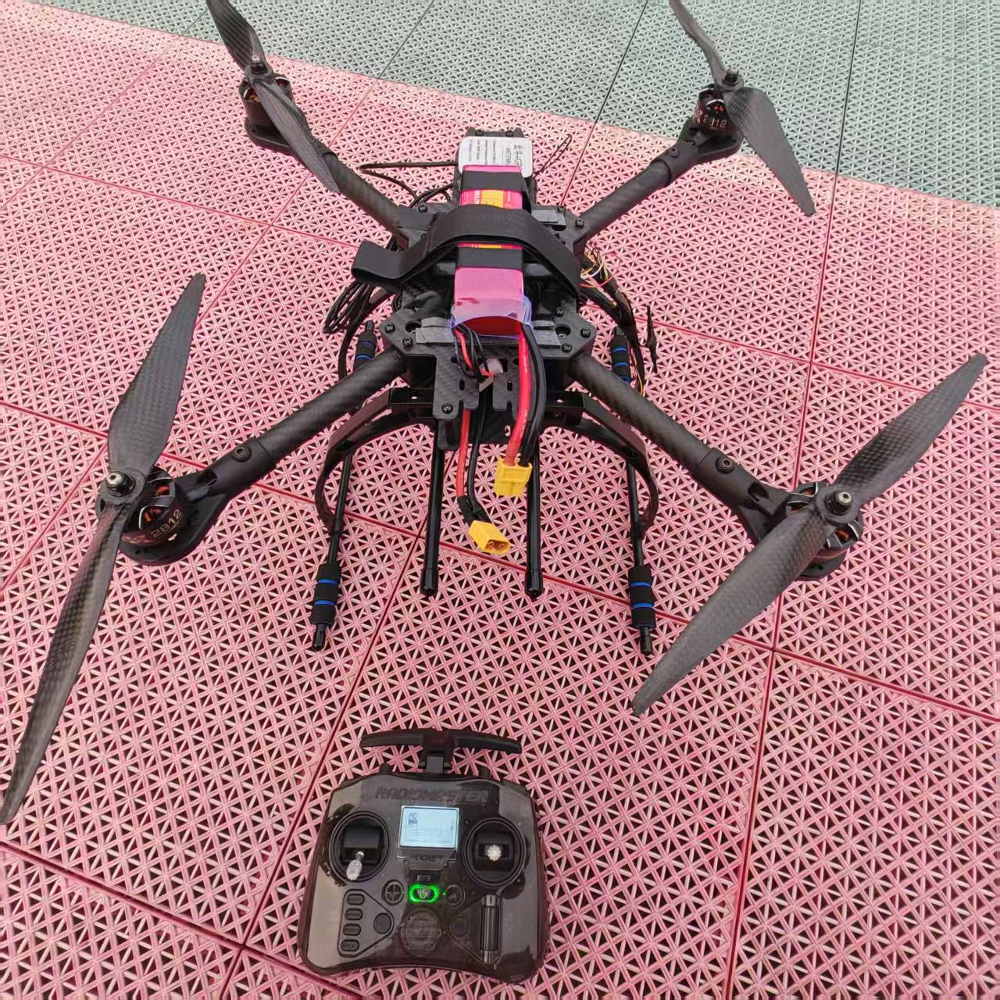
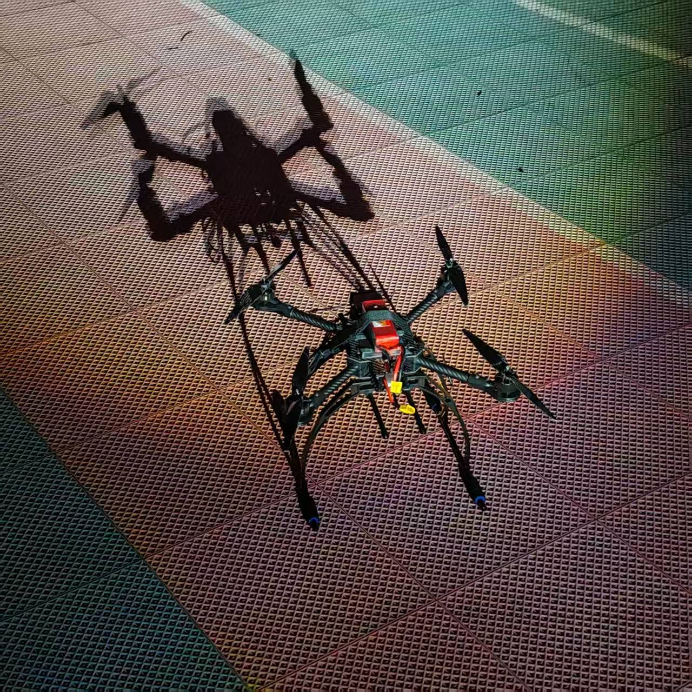
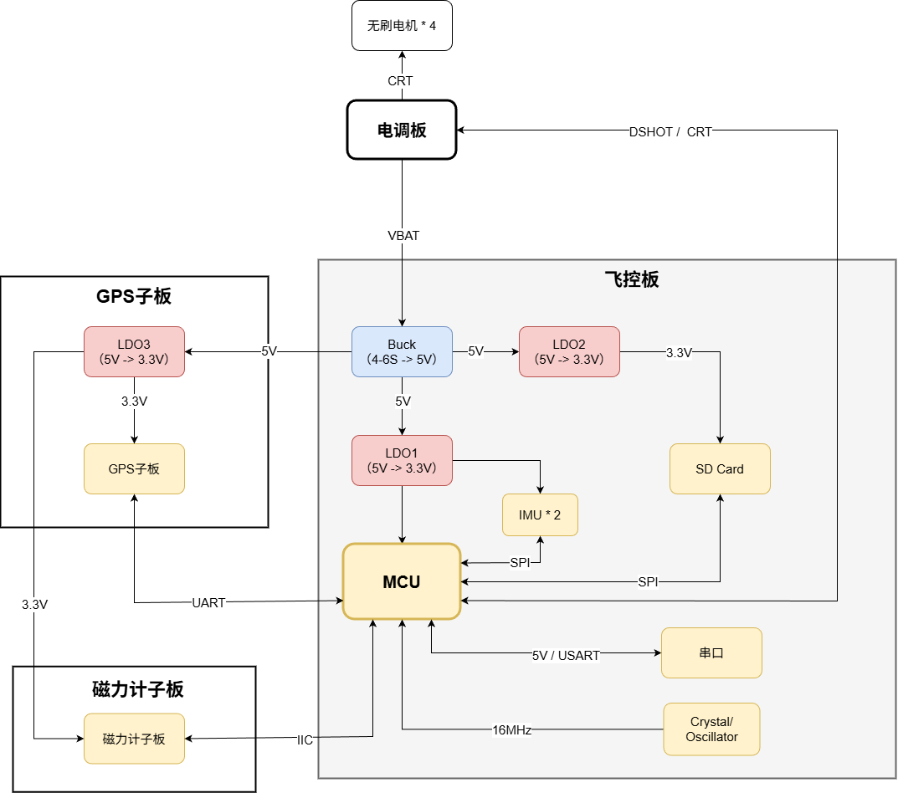
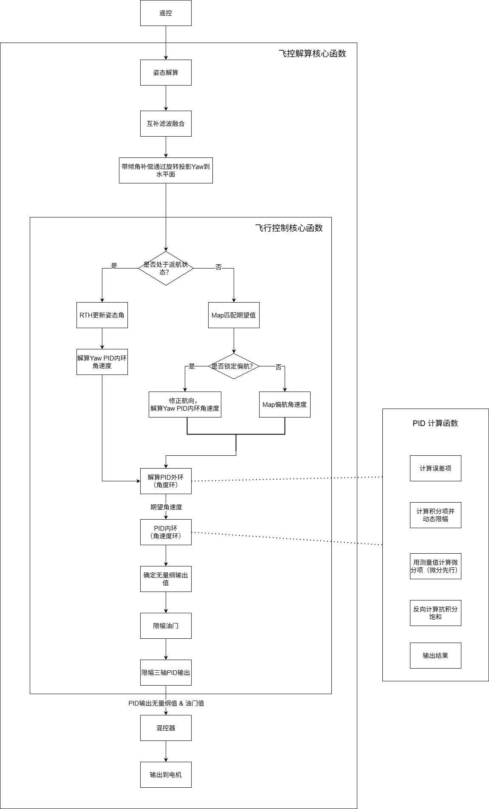

# Alpha-Flight-2.X

高性能开源四旋翼飞行器固件与硬件解决方案。
A high-performance quadcopter flight controller firmware and hardware solution.

## 实物与外场测试展示 / Hardware & Flight Showcase
>
> 完成台架空桨验证与初步外场试飞（Angle Mode），当前正进行闭环姿态与 PID 参数精调。
> Hardware validated via bench tests. Currently undergoing outdoor flight tests (Angle Mode) for PID stabilization.

  
  

## 项目简介 / Project Overview

本项目为一套完整的 10 英寸四旋翼无人机开发方案，包含底层飞控逻辑、硬件选型及配套 PCB 工程。为保障代码的模块化与安全性，飞控逻辑与电机电调调试通道（Passthrough）采用独立模块化设计。

This project is a complete 10-inch quadcopter development solution, featuring custom flight control firmware and a modular hardware/PCB ecosystem.

## 核心特性与系统架构 / Technical Highlights

### 硬件拓扑 / Hardware Topology

### 控制逻辑 / Control Flow

* **控制系统 / Control Loop**:
  * 集成微分先行（Derivative on Measurement）与动态反向计算（Back-Calculation）抗饱和逻辑。
  * High-frequency cascade PID loop with Derivative on Measurement and Dynamic Anti-Windup.
* **硬件冗余 / Redundancy**:
  * 双 IMU (ICM-42688P) SPI 冗余架构。
  * Dual ICM-42688P IMUs connected via independent SPI buses.
* **电源设计 / Power Design**:
  * 基于 TPS54560 的 6S 兼容电源设计，实现模拟/数字电源隔离。
  * TPS54560-based 6S-compatible power topology with signal/power isolation (3.3V_Clean & 3.3V_Dirty).
* **连接性 / Connectivity**:
  * 支持 ELRS/CRSF 协议，集成 SPI 接口黑匣子日志记录。
  * ELRS/CRSF protocol support and integrated Blackbox logging via SPI.

## 硬件与文档架构 / Hardware & Documentation

本项目所有的硬件 PCB 均经过实物打板验证（包含主控板、GPS 子板及磁力计子板），并完成了完整的动力系统空桨台架测试。

* **PCB 设计 (Hardware Design)**: 包含原理图、BOM 物料清单、电源拓扑分析。详细单板高清大图请查阅 `Document/实物展示/`。
* **控制理论 (Control Theory)**: 包含 PID 动态反向计算的理论推导与实践代码。
* **生产文件 (Manufacturing)**: 包含飞控主板、外设子板的完整 Gerber 生产工程文件。

## 待优化项 / Future Work

- **PID Tuning**: 针对低空地效干扰（Ground Effect）导致的振荡，进一步优化 Dynamic Anti-Windup 的阈值。
* **Barometer**: 排查 I2C 气压计硬件异常，未来计划替换或重新 Layout。
