# Alpha-Flight-2.X

基于 STM32F405 的十寸四旋翼飞行控制器，覆盖 Flight Controller 硬件、实时 Firmware、State Estimation、串级 Control、动力输出、安全保护、Blackbox 与实飞诊断。

本项目由个人独立设计与实现，最初采用裸机中断调度，现已重构为 FreeRTOS/CMSIS-RTOS2 事件驱动架构。当前已完成基础姿态增稳与 Heading Hold 的实飞验证；Velocity Hold 与 Position Hold 已打通完整控制链，但仍处于实验验证阶段，不能视为可靠的自主定位能力。

<p align="center">
  <a href="https://tephya.github.io/Alpha-Flight-2.X/">
    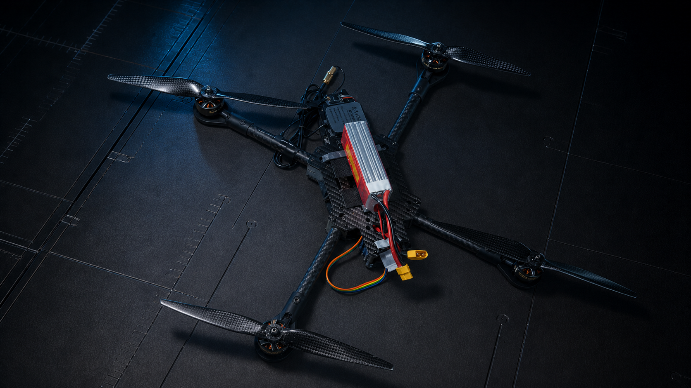
  </a>
</p>

<p align="center">
  <a href="https://tephya.github.io/Alpha-Flight-2.X/"><strong>项目演示网站</strong></a>
  · <a href="#system-architecture">Architecture</a>
  · <a href="#build">Build</a>
  · <a href="#known-limitations">Known Limitations</a>
</p>

> 当前状态基于 2026-08-28 的源码与实测记录。Firmware 尚未达到量产或无人值守飞行标准；网页中的 Flight Test 视频与 Hardware 照片用于展示已完成的实机验证，不扩大下文声明的能力边界。

## 当前能力

| 状态 | 能力 | 说明 |
| --- | --- | --- |
| 已验证 | Manual 姿态飞行 | Roll/Pitch 姿态增稳、Manual Yaw、Airmode、Mixer 去饱和与 DShot600 输出已完成实飞验证 |
| 已验证 | Heading Hold | Gyro 积分与 Mag 慢校正融合，可持续抵抗并拉回小幅偏航 |
| 已验证 | 双 IMU 调度 | 两颗 ICM-42688P 独立 SPI/DRDY 链路，支持 active/standby、快切慢回与 stale-frame 防护 |
| 已验证 | 安全与诊断 | SystemReady 解锁门控、RC lost、低压、双 IMU 故障、异常倾倒停桨、IWDG 与二进制 Blackbox |
| 实验阶段 | Velocity Hold | IMU 高频预测与 GPS Velocity Correction 已接入闭环，受单 GPS 低速观测质量限制 |
| 实验阶段 | Position Hold | Position→Velocity→Acceleration→Attitude 串级链已打通，但尚不能稳定、可重复地抗风定点 |
| 未实现 | 自主飞行功能 | RTH、Altitude Hold、Vertical Velocity Hold、自动起降尚未实现 |

## System Architecture

<p align="center">
  <a href="docs/assets/architecture/01-system-overview.png">
    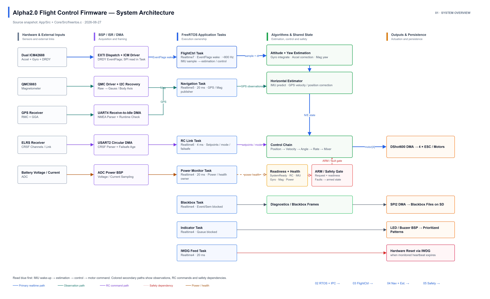
  </a>
</p>

系统以双 IMU 的 DRDY 事件驱动标称 800 Hz Flight Control 周期。FlightCtrl Task 只消费 active IMU 的新帧；GPS、Mag、RC、SD 与 Indicator 等较低速业务由独立 Task 处理，并通过 EventFlags、Queue、最新值 Mailbox 和 Semaphore 交换状态或数据。

核心数据链为：

```text
Dual IMU DRDY
→ Attitude / Yaw Estimation
→ Horizontal State Estimation
→ Position Target → Velocity Target → Acceleration Target
→ Attitude Target → Rate Target
→ Mixer Desaturation
→ 4-channel DShot600
```

<details>
<summary><strong>RTOS 调度与 FlightCtrl 主链</strong></summary>

<p align="center">
  <a href="docs/assets/architecture/02-rtos-tasks-and-ipc.png">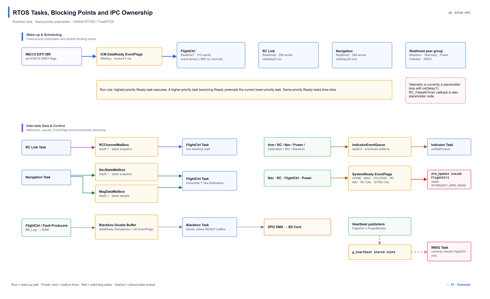</a>
</p>

<p align="center">
  <a href="docs/assets/architecture/03-flightctrl-pipeline.png">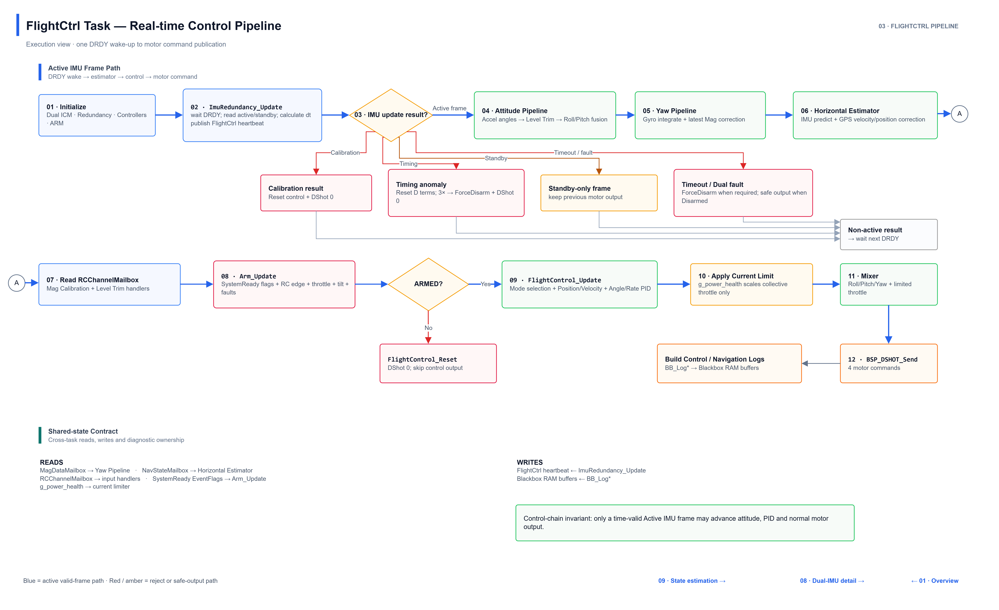</a>
</p>

</details>

<details>
<summary><strong>Navigation、Horizontal Estimator 与水平控制</strong></summary>

<p align="center">
  <a href="docs/assets/architecture/04-navigation-and-estimation.png">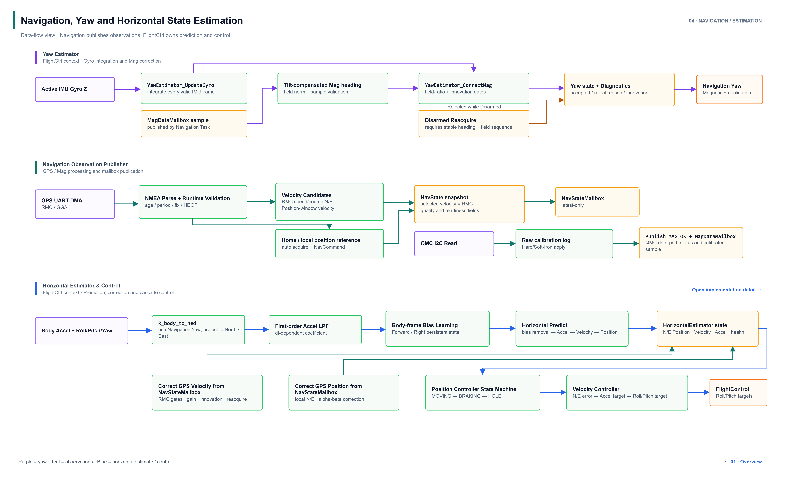</a>
</p>

<p align="center">
  <a href="docs/assets/architecture/06-horizontal-control-detail.png">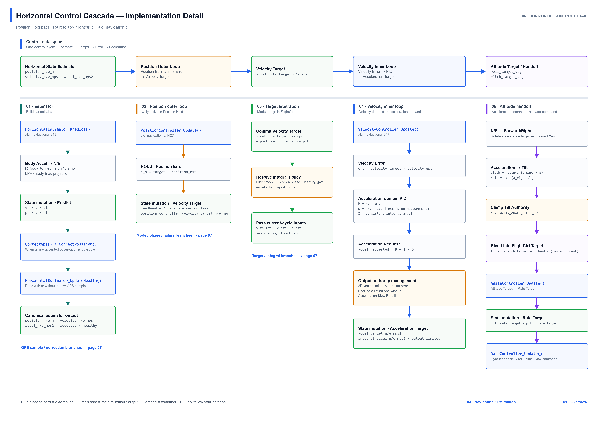</a>
</p>

<p align="center">
  <a href="docs/assets/architecture/07-horizontal-control-branches.png">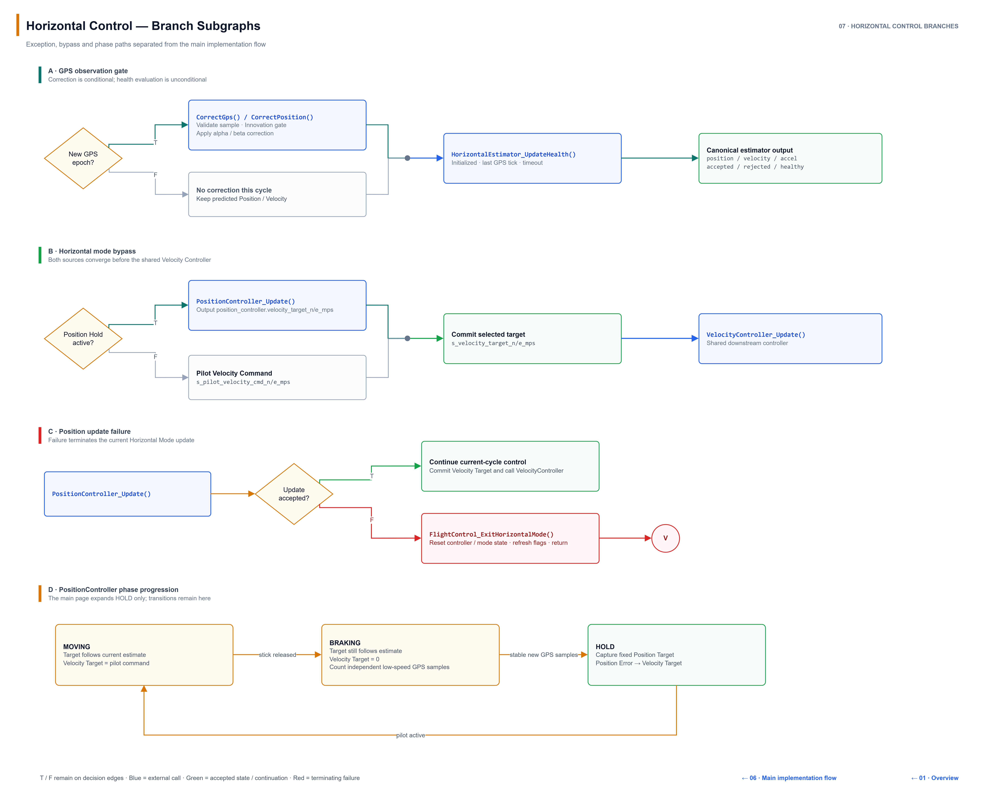</a>
</p>

</details>

<details>
<summary><strong>Safety、双 IMU 与 Yaw/Mag 状态机</strong></summary>

<p align="center">
  <a href="docs/assets/architecture/05-safety-arm-calibration.png">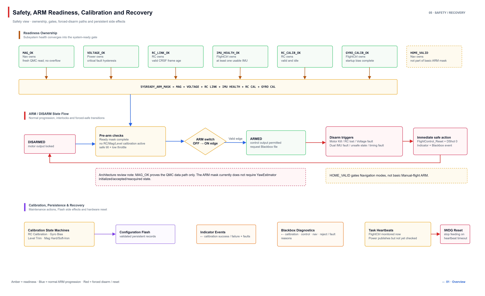</a>
</p>

<p align="center">
  <a href="docs/assets/architecture/08-dual-imu-acquisition-and-failover.png">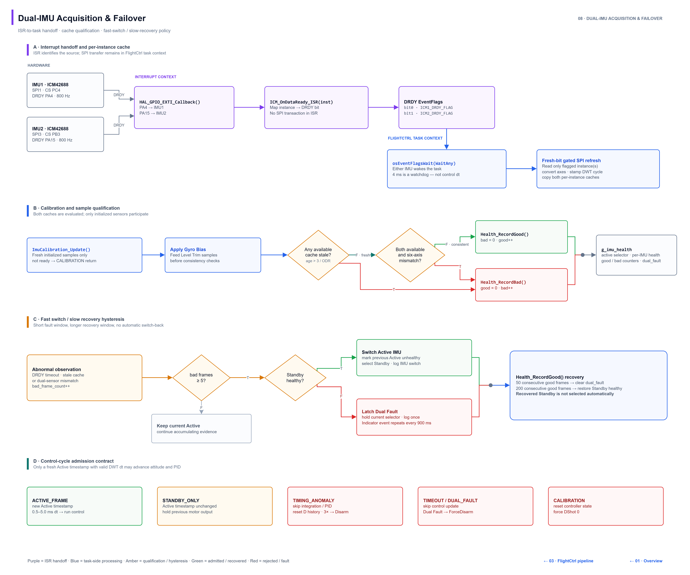</a>
</p>

<p align="center">
  <a href="docs/assets/architecture/09-attitude-and-yaw-state-estimation.png">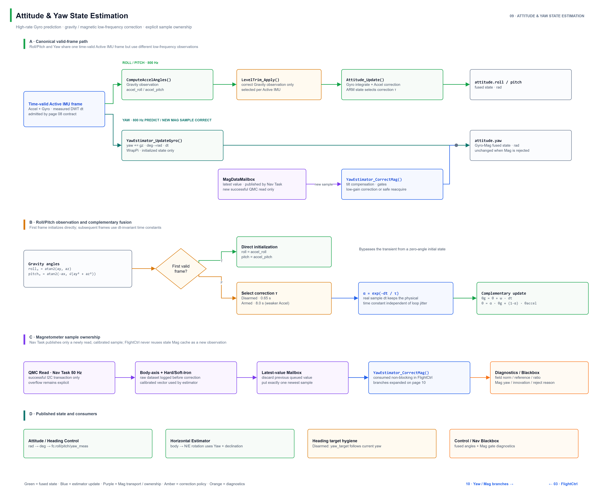</a>
</p>

<p align="center">
  <a href="docs/assets/architecture/10-yaw-and-magnetometer-correction-branches.png">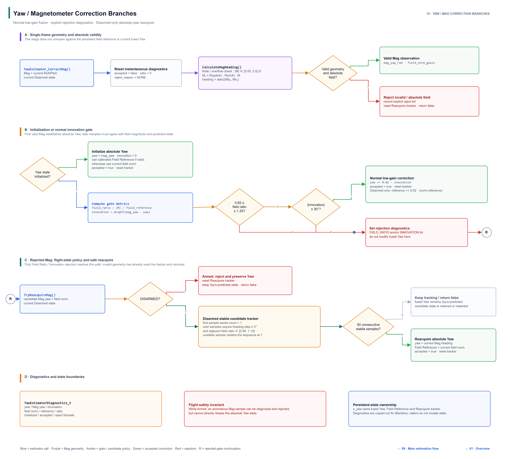</a>
</p>

</details>

<details>
<summary><strong>Control、动力输出与 Blackbox</strong></summary>

<p align="center">
  <a href="docs/assets/architecture/11-control-mixer-and-dshot-output.png">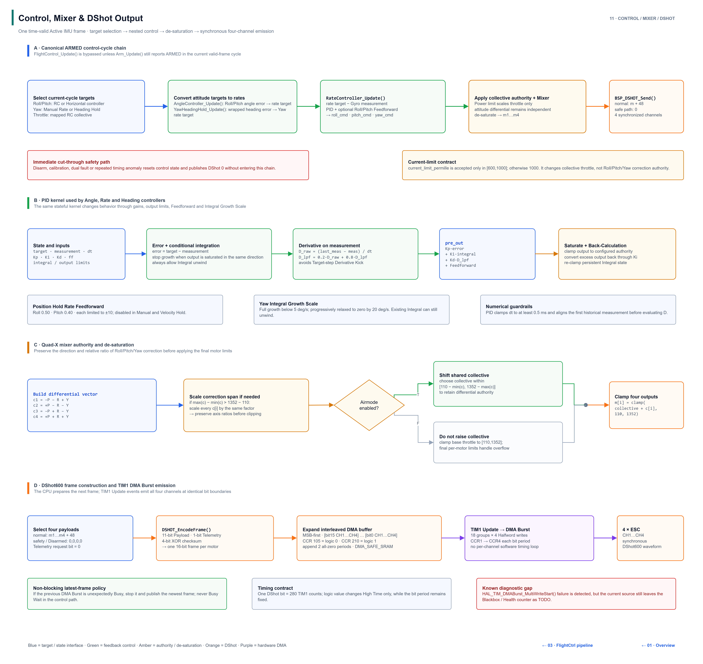</a>
</p>

<p align="center">
  <a href="docs/assets/architecture/12-blackbox-persistence-and-offline-diagnosis.png">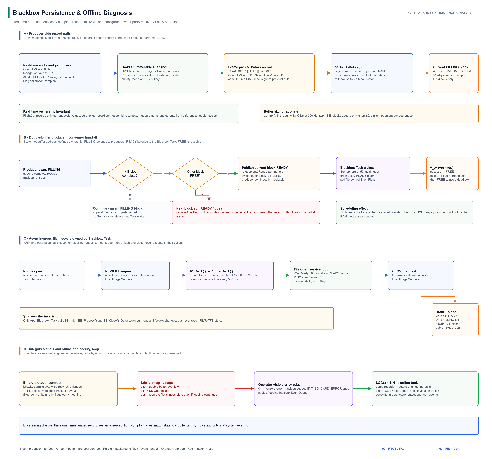</a>
</p>

</details>

Draw.io 可编辑源文件见 [`docs/architecture-source/alpha2-architecture.drawio`](docs/architecture-source/alpha2-architecture.drawio)，全部导出图见 [`docs/assets/architecture`](docs/assets/architecture/)。

## Hardware

| 模块 | 当前配置 |
| --- | --- |
| Flight Controller | STM32F405RGT6，168 MHz，Cortex-M4F |
| Frame | 翱胜创新 IDF 十寸机架 |
| Motor | 4 × XRotor 2812 1100KV |
| ESC | XRotor 65A 4-in-1 6S Lite BLS RTF |
| Propeller | APC 10×5（APC1050） |
| Flight Battery | 红牌 2200 mAh 4S 25C |
| Power Design | Flight Controller 兼容 4S/6S 输入；当前实飞动力配置使用 4S 电池 |
| IMU | 2 × ICM-42688P，独立 SPI 与 DRDY EXTI |
| Magnetometer | QMC5883，I2C，Hard/Soft-Iron 校正与 Bus Recovery |
| GPS | ATGM332D，UART DMA + IDLE，115200 bps，GGA/RMC 10 Hz |
| RC Link | ELRS/CRSF，USART2 420000 bps，Circular DMA |
| Motor Output | TIM1 DMA Burst 并行生成 4 路 DShot600 |
| Blackbox | Micro SD，SPI2 DMA，4096 B × 2 RAM Buffer |

Flight Controller 原理图、PCB Layout、Firmware 和配套 ESC passthrough 均围绕该实机完成。电源输入兼容范围不代表任意电机、桨叶与 6S 电池组合均可安全使用。

## Firmware Design

### RTOS 任务边界

| Task | Priority | 主要职责 |
| --- | --- | --- |
| `Task_FlightCtrl` | Realtime7 | IMU、姿态与 Yaw、校准、ARM、水平估计、串级控制、Mixer、DShot、控制日志 |
| `Task_RC_Link` | Realtime6 | CRSF DMA 解析、RC Calibration、链路状态与最新值 Mailbox |
| `Task_Nav` | Realtime5 | GPS、QMC、Mag 校正、I2C Recovery、Nav/Mag Mailbox |
| `Task_Blackbox` | Realtime4 | FatFS 文件生命周期与双缓冲异步写盘 |
| `Task_PowerMonit` | Realtime4 | VBAT/Current 采样、低压状态与 CurrentLimiter 数据 |
| `Task_Indicator` | Realtime4 | LED/Buzzer 事件优先级与非阻塞节拍 |
| `Task_IwdgFeed` | Realtime4 | 汇总各 Task Heartbeat 并决定是否喂狗 |
| `Task_Telemetry` | Realtime4 | 预留，当前尚无正式业务 |

FreeRTOS 采用抢占式调度和 1 kHz Tick。调用 RTOS API 的 ISR 只使用对应的 `FromISR` 接口；耗时处理被移出 ISR，由 Task 在事件到达后执行。

### State Estimation

- Roll/Pitch：Gyro 积分与 Accel 低频校正组成互补姿态估计。
- Yaw：每个 active IMU 新帧积分 `gz`，新 Mag 到达时进行倾斜补偿和受门限约束的慢校正。
- Horizontal Estimator：IMU Acceleration 高频预测 Velocity/Position；新 GPS epoch 到达后执行 Velocity 与 Position Correction。
- Accel Bias：持久状态保存在 Body Frame，再按当前 Yaw 投影到 N/E，避免转向后把固定机体偏差解释为新的地理坐标偏差。

### Control and Actuation

```text
Position P
→ Velocity PID
→ N/E Acceleration Target
→ Roll/Pitch Target
→ Angle P
→ Rate PI + Feedforward
→ Mixer Scale / Shift / Clamp
→ DShot600
```

Manual、Velocity Hold 和 Position Hold 共用内层姿态与 Rate Control。Position Hold 额外使用 `INACTIVE → MOVING → BRAKING → HOLD` 状态机管理 Anchor 捕获和 Integral 生命周期，避免在飞行器仍运动或 GPS Observation 不一致时学习错误的静态补偿。

### Safety Chain

基础 ARM 需要 Mag、Voltage、RC Link、IMU Health、RC Calibration 和 Gyro Calibration 全部 Ready，并要求真实的 ARM OFF→ON 边沿、低油门和机体倾角约束。Armed 期间检测到人工 Disarm、RC lost、双 IMU fault、确认低压或异常倾倒后，会在 FlightCtrl 周期内强制发送四路 DShot 0。

## Blackbox and Offline Analysis

Firmware 将不同 Record 编码为带 Magic、Type 与定长 Payload 的小端二进制帧。Control V4 约 200 Hz，Navigation V5 约 20 Hz；离线工具可完成帧重同步检查、工程单位换算、CSV 导出和控制/导航专项绘图。

建议将公开工具放在：

```text
Tools/Blackbox/
├── blackbox_analyzer.py
├── mag_cal_fit.py
├── requirements.txt
└── README.md
```

其中 `blackbox_analyzer.py` 对应原 `SD_RC_PARSE/main.py`，`mag_cal_fit.py`用于 Hard/Soft-Iron 椭球拟合。不要复制 `__pycache__`、编号日志目录、批量 BIN/CSV/PNG，以及只面向早期日志格式的 `analyze_arm_chatter.py`。

安装依赖并解析日志：

```bash
python -m pip install -r Tools/Blackbox/requirements.txt
python Tools/Blackbox/blackbox_analyzer.py LOGxxx.BIN --csv --no-show
python Tools/Blackbox/mag_cal_fit.py LOGxxx_analysis.csv
```

## Build

当前工程在以下环境通过编译：

| Item | Version |
| --- | --- |
| IDE | Keil MDK-ARM Plus 5.36.0.0 |
| Compiler | Arm Compiler 5.06 update 7, build 960 |
| Device Pack | Keil STM32F4xx DFP 3.1.1 |
| MCU | STM32F405RGTx |
| Configuration | `CubeMX_Create.ioc` |
| Keil Project | `MDK-ARM/CubeMX_Create.uvprojx` |

1. 安装上述 Device Pack 与 Arm Compiler 5。
2. 使用 Keil MDK 打开 [`MDK-ARM/CubeMX_Create.uvprojx`](MDK-ARM/CubeMX_Create.uvprojx)。
3. Build `CubeMX_Create` Target，并通过 ST-Link 下载到 Flight Controller。
4. Flash Download 选择 **Erase Sectors**，不要使用 **Erase Full Chip**；Sector 11 用于保存 RC Calibration 与 Level Trim 等配置。

CubeMX 重新生成代码后，需要复查 FatFS `diskio.c`补丁与 DMA-safe SRAM 放置，避免生成代码覆盖板级修正。

## Repository Layout

```text
Alpha2.0/
├── App/
│   ├── Inc/
│   └── Src/
│       ├── app_*       # Task-level application and state machines
│       ├── alg_*       # Estimation, control, PID and mixer algorithms
│       └── bsp_*       # Board support and peripheral protocols
├── Core/               # STM32 startup, HAL init and FreeRTOS entry
├── Drivers/            # STM32 HAL and CMSIS
├── Middlewares/        # FreeRTOS, FatFS and CMSIS-RTOS2
├── FATFS/              # FatFS application glue
├── MDK-ARM/            # Keil project and scatter configuration
├── docs/               # GitHub Pages, Architecture and engineering records
├── Tools/Blackbox/     # Offline log and Mag calibration tools
└── CubeMX_Create.ioc
```

## Documentation

- [Project Website](https://tephya.github.io/Alpha-Flight-2.X/)：Flight Test 视频、整机展示与自研 Hardware 实物照片。
- [项目当前状态](docs/项目当前状态.md)：当前源码、实测结论、参数、能力边界与后续原则。
- [变更与踩坑记录](docs/变更与踩坑记录.md)：从 RTOS 迁移到实飞调试的演进过程、失败路径与根因分析。
- [Architecture diagrams](docs/assets/architecture/)：System Overview 与各核心模块的详细流程图。
- [Draw.io source](docs/architecture-source/alpha2-architecture.drawio)：12 页 Architecture 图的可编辑源文件。

## Known Limitations

- Position Hold 尚未达到可重复、可放手依赖的可靠性，不应据此启用 RTH 或扩大飞行包线。
- 当前只有单 GPS，缺少 Optical Flow、RTK 或其他独立低速水平速度基准。
- Barometer 已损坏，当前没有 Altitude Hold、Vertical Velocity Hold 或自动降落能力。
- 双 IMU 六轴数值一致性门限仍处于待标定状态；通信、staleness、校准和 active/standby 保护仍有效。
- `CurrentLimiter`当前关闭，只保留 Current Measurement、滤波与 Blackbox 数据链。
- 启动阶段仍存在 Kernel 启动前 DShot 握手与直接喂 IWDG 的临时脚手架，后续需要迁移到正式启动状态机。

完整边界和当前参数以[项目当前状态](docs/项目当前状态.md)及当前源码为准。

## Safety and License

该项目包含高速旋转动力系统控制代码。修改、烧录或测试前应拆除桨叶，并独立验证 Motor Mapping、旋转方向、Failsafe、Disarm 和 DShot 0 输出。当前 Firmware 仅用于研发与实验验证。

本仓库目前未采用开源许可证。源代码公开用于作品展示和技术审阅，但未授予复制、修改、分发或商业使用许可；如需使用，请先联系仓库作者。
